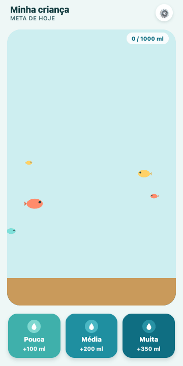

# Water Tank 🐠

Personal app, built to encourage my 3-year-old daughter to drink water.
A single screen: a fish tank fills up with animated water as she drinks,
until she hits her daily goal. No login, no internet needed once
installed, no ads.

It's a PWA (Next.js): opens in the browser and can be "installed" on the
phone's home screen, no app store involved.



## How it works

- She taps one of three cups (small / medium / large — no text, she can't
  read yet) each time she drinks.
- The tank fills up gradually, with a school of fish swimming around, and
  reacts with an animation (bounce + bubbles + a floating drop) on every
  tap. A chime plays and a playful voice narrates a message out loud.
- When she hits the daily goal, the tank celebrates with a 🎉 and a
  randomized, name-personalized message read aloud.
- An adult configures the daily goal, the child's name, the ml amount for
  each cup size, and can reset today's water from the gear icon (⚙️).

## Stack

- [Next.js](https://nextjs.org) (App Router + TypeScript)
- SVG + CSS (keyframes/transitions) for the animations — no external
  animation library
- Web Speech API + synthesized audio for the drink chime and voice
  narration
- `localStorage` to save progress — everything local, no backend and no
  account
- Custom manifest + service worker to work as an installable PWA

## Running locally

```bash
npm install
npm run dev
```

Open [http://localhost:3000](http://localhost:3000).

## Deploy

Meant to run on [Vercel](https://vercel.com): connect the repository and
every push to `main` builds and publishes automatically.

## Installing on a phone

Open the published URL in Safari (iOS) or Chrome (Android) and use "Add
to Home Screen" — the app opens full-screen, like a native app.

## Planning

See [`TODO.md`](./TODO.md) for the MVP scope and the backlog of future
ideas (notifications, weekly history, multiple profiles).
